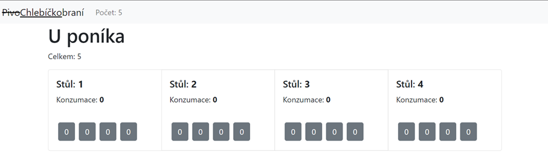

# Chlebíčkobraní  

Verze 1 

Pořádáme soutěž v pojídání chlebíčků a požadujeme k tomu jednoduchou aplikaci pro evidenci výsledků soutěže. Soutěží čtyři týmy, každý má až čtyři členy. 

Po několika snězených chlebíčcích: 

1. Vytvořte základní strukturu aplikace 
2. Definujte nutné komponenty 
3. Vymyslete způsob, jak předávat data mezi komponentami 
4. Použijte v aplikaci useState pro ukládání dat. 
5. Použijte useEffect pro aktualizaci dat v nadřízené komponentě. (Pokud je to nutné)

## Rozšíření aplikace (pokud máte vše předchozí hotovo)

1. Lze aplikaci rozšířit tak, aby byl počet stolů a členů proměnný? 
2. Lze aplikaci rozšířit tak, aby bylo možné přidávat nové stoly a hráče během samotné hry? 

# Poznámky

* Pro vzhled poskytnutého kódu je použit https://react-bootstrap.github.io/, jeho použití není povinné.
* Ve složce /src/components/helpers jsou funkce pro snazší práci s vícerozměrnými poli